# QueueSmart — Queue Management Web App
### COSC 4353 - Software Design | Group 12

Full-stack web app that allows people to join queues for different services, and admins to manage them.
Includes user-friendly interactions for both the public user and admins.
Was built with authentication, real-time interactions and functional interconnected pages.

---

## What it does

**Users can:**
- Join a queue for available service
- See position and estimated wait time in real-time
- Get custom notifications
- Leave the queue if needed
- Submit feedback after their visit
- View queue activity history

**Admins can:**
- Monitor all active queues from a dashboard
- Serve, move, or remove users from any queue
- Open, pause, or close queues
- Create, edit, or delete services
- Send custom notifications
- View reports and submitted feedback

---

## Tech Stack

| Side | Tech |
|------|------|
| Frontend | React, Vite |
| Backend | Node.js, Express.js |
| Database | MongoDB, Mongoose |
| Auth | JWT, bcryptjs |

---

## How to run

### Prerequisites
- Node.js
- MongoDB running locally on port 27017

### Installation

1. Clone the repo
```bash
git clone https://github.com/Fifer-code/Software-Design.git
cd Software-Design
```

2. Install backend dependencies
```bash
cd backend
npm install
```

3. Install frontend dependencies
```bash
cd ../frontend
npm install
```

### Running the app

Start the backend (runs on port 8080):
```bash
cd backend
npm start
```

Start the frontend (runs on port 5173):
```bash
cd frontend
npm run dev
```

The database seeds itself automatically on first run:
services, queue entries, history, and feedback are all pre-loaded so the app is ready to explore right away.

---

## Test Accounts

| Role | Email | Password |
|------|-------|----------|
| Admin | admin@test.com | admin123 |
| User | user@test.com | user123 |

---

## Screenshots

**Login & Registration**
<p>
  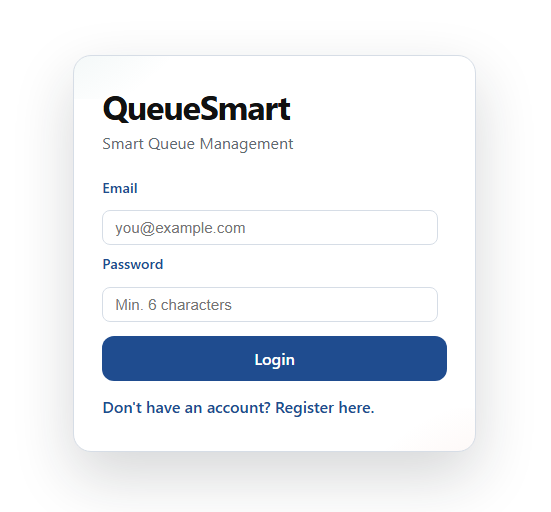
  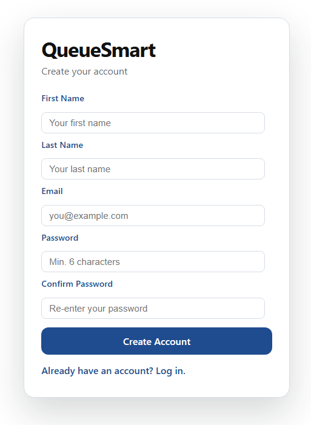
</p>

**User Side**
<p>
  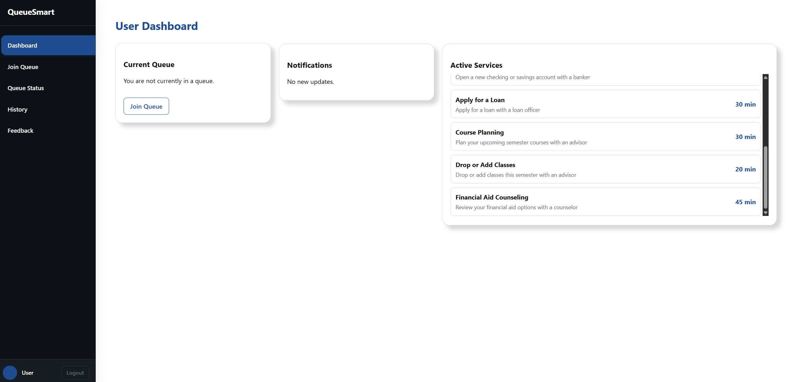
  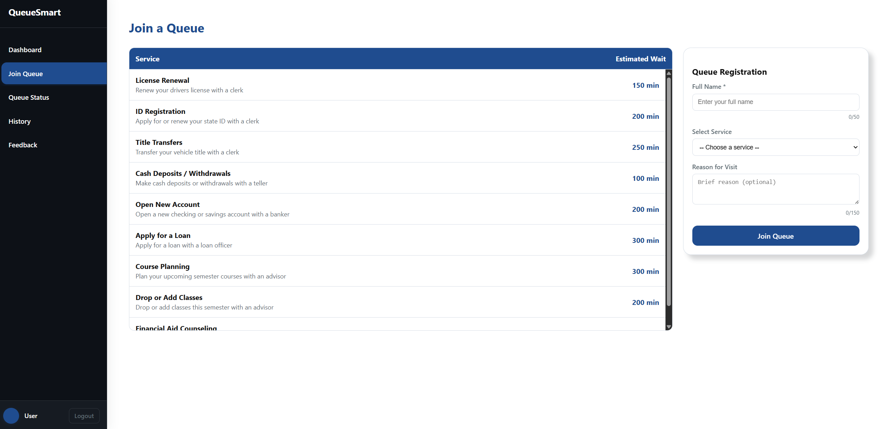
  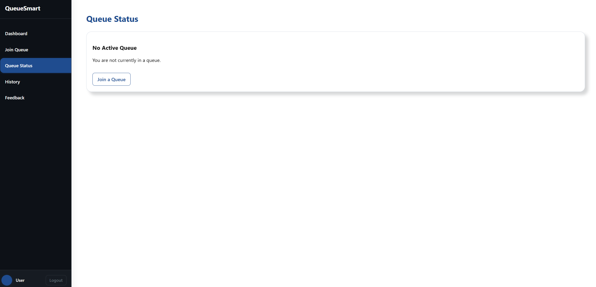
</p>
<p>
  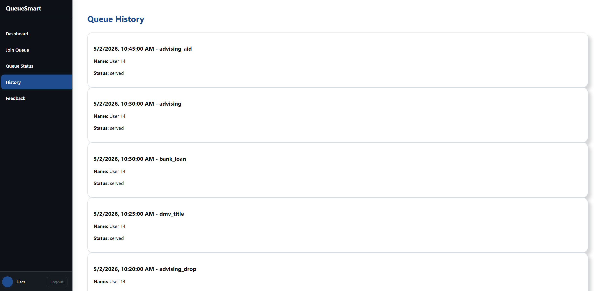
  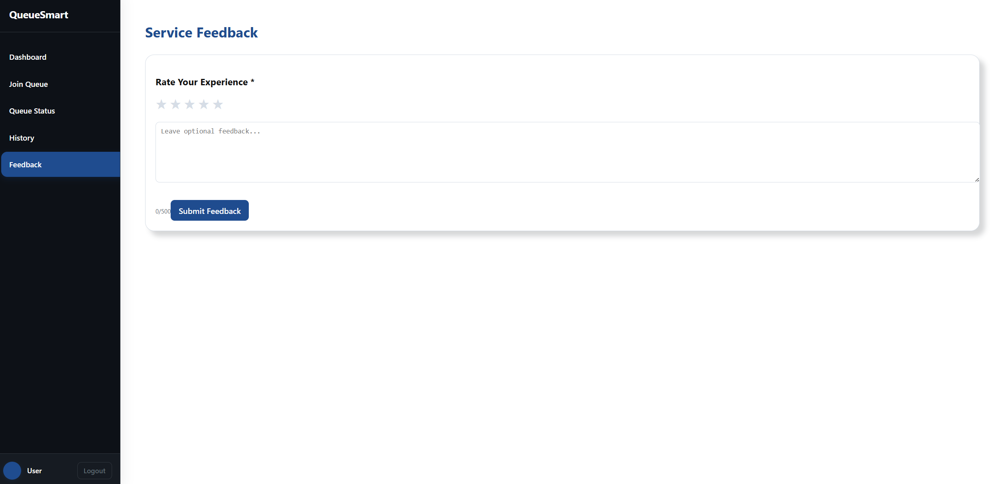
</p>

**Admin Side**
<p>
  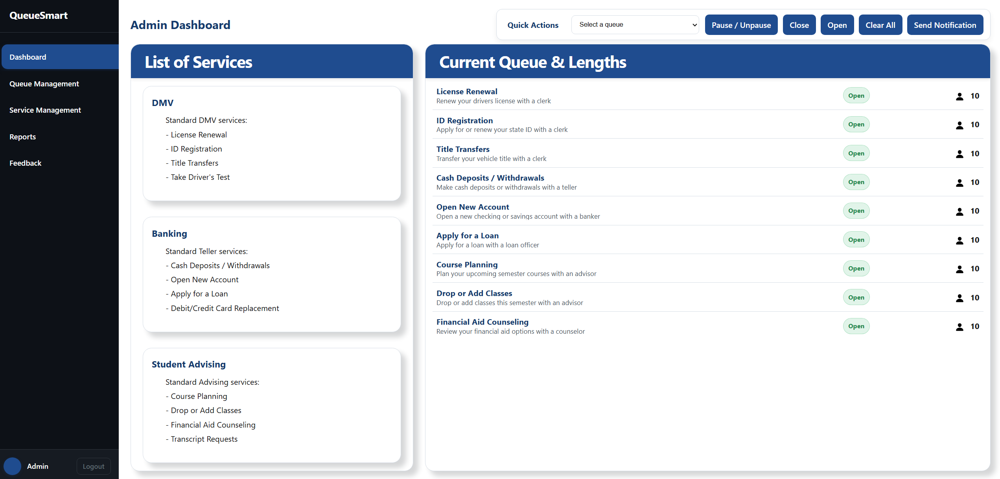
  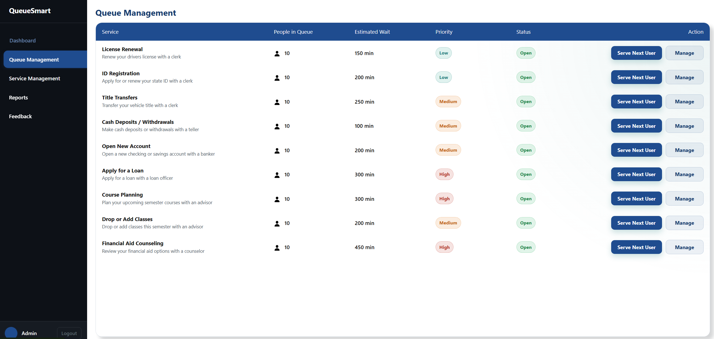
  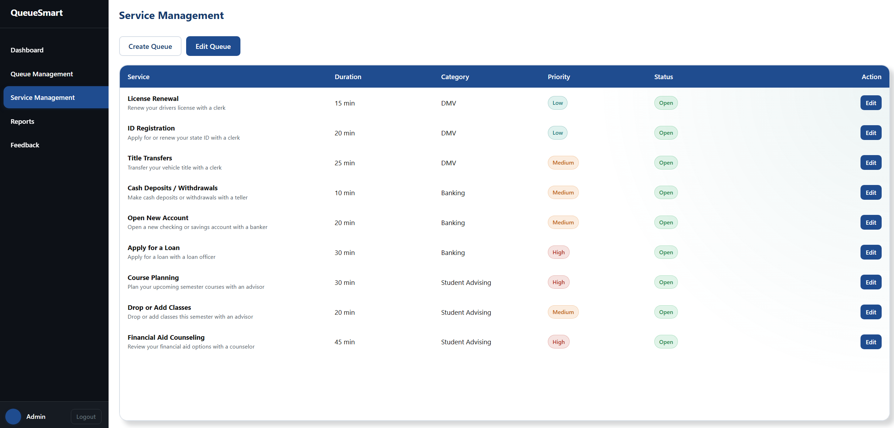
</p>
<p>
  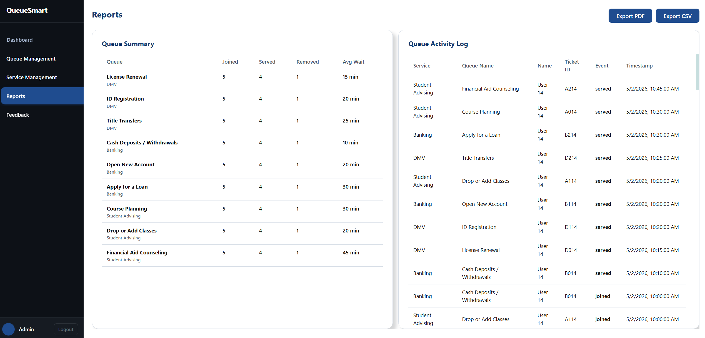
  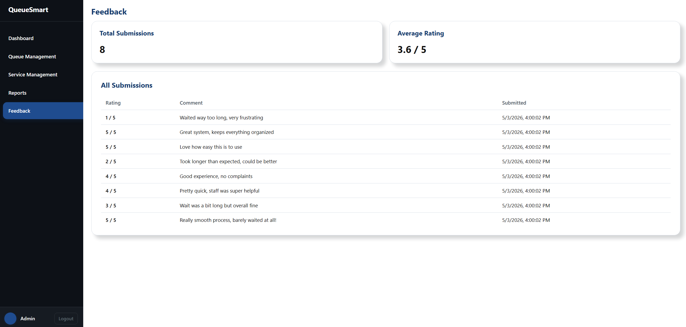
</p>
